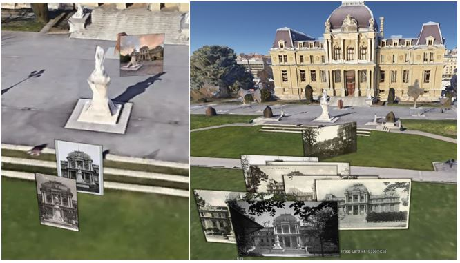

# Icono Lausanne: Reorientation of the photographic archives of the Historical Museum

## Basic information

Student: Boubacar Camara

Professors: Frédéric Kaplan, Isabella di Leonardo

Supervisor:  Rémi Petitpierre

  
## Introduction

  
The Lausanne historical museum has collected 38’680 historical images from the Lausanne region, mainly between the 18th and 21th century.

This project consists in the development of semi-automatic methods to infer the position and orientation in which photographs have been taken.

## Installation & usage
### Python
All the code written in the Jupyter Notebook `Iconolausanne.ipynb`.
Create and install a new conda environment from the requirements `requirements.txt` with:

    conda create --name <env> --file requirements.txt
    #Then activate and run jupyter
    conda activate <env>
    jupyter notebook

You should then select the newly created environment when opening the notebook.

### Meshroom
Please follow these [guidelines](https://github.com/alicevision/meshroom) in order to install Meshroom.

### Google Earth
Please install the desktop version of [Google Earth](https://www.google.com/earth/download/gep/agree.html?hl=en-GB).

  

## Research summary
Our approach to infer the position and orientation images is composed of three main parts:

 1. Identification of image clusters using Pixplot.

 2. Application of photogrammetry on similar images using Meshroom.

 3. Annotation of the true position and orientation of at least two recovered images in order to align the other cameras accordingly.
 
 4. Evaluation of the alignments distances with respect to their annotation.
 
 5. Visualization of the results in Google Earth
	  
## Results

Results obtain by applying the pipeline on images from the Tribunal de Montbenon.

Images used in this project are coming from the [Musée Historique de Lausanne](https://www.lausanne.ch/vie-pratique/culture/musees/mhl.html).

